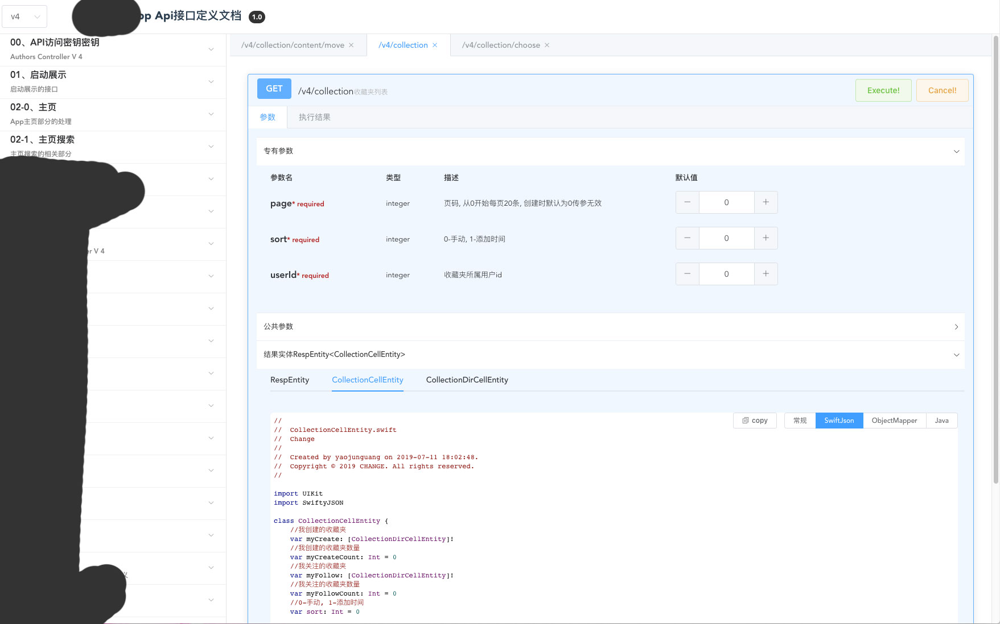
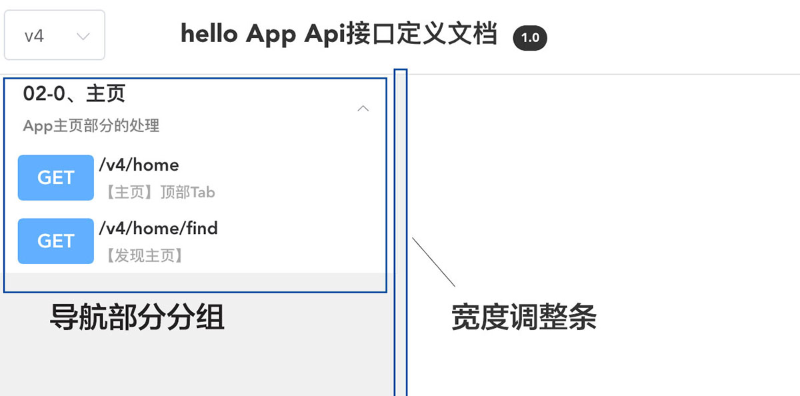
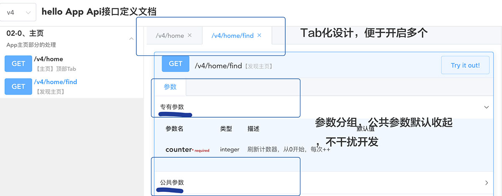
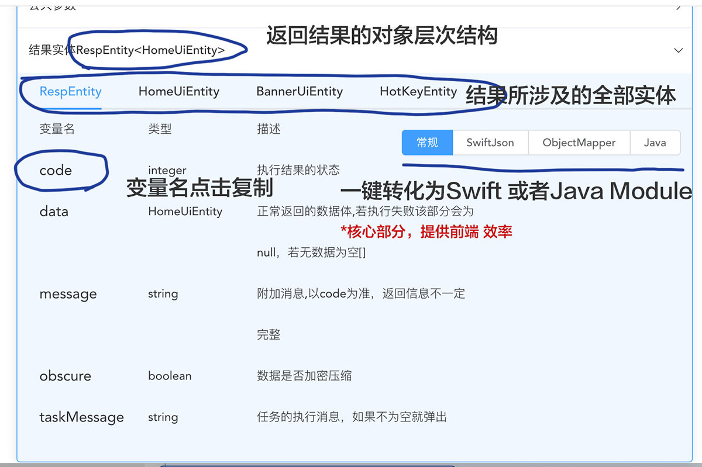
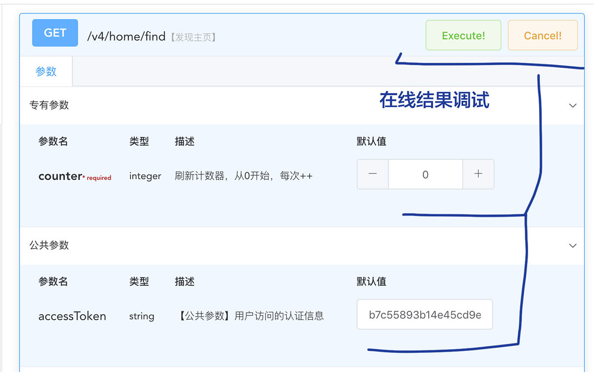
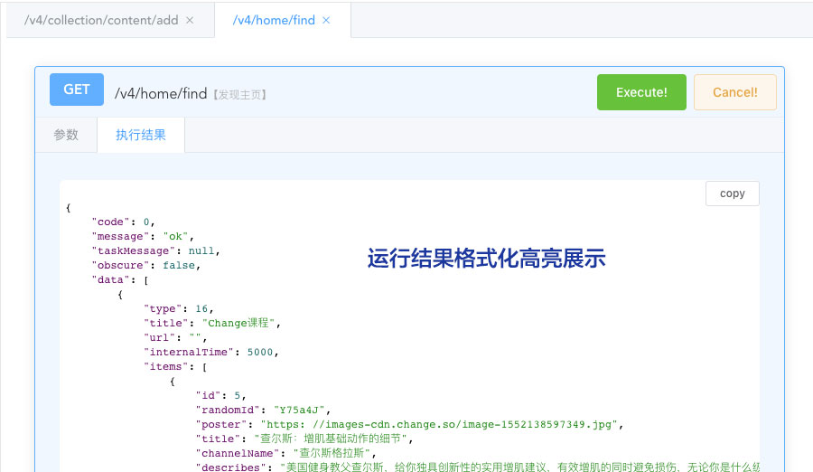

# swagger-ui

> 采用Vue+element-ui构建的swagger-ui

## 介绍



##### 1、采用左右布局，便于充分利用屏幕空间

##### 2、左侧方案按tag分组，便于集中管理
##### 3、左侧导航栏支持宽度调整，调整结果保存到cookie

##### 4、右侧项目部分tab化管理，便于打开多个
##### 5、参数可分组，默认以描述中以"【公共参数】"开头的放入到公共参数中（具体原因后续有机会在介绍），该函数独有参数放入专有参数并默认展开
##### 6、返回实体结果全部列举，支持一键转化为swift和java，module代码格式化高亮处理，一键复制


##### 7、在线直接调用测试

##### 8、运行结果格式化高亮展示


### 约定

> 该swagger是根据我在日常开发中的一些个人需求自行定制的swagger-ui,其中涉及到诸多约定  
> 1、返回结果为JSON  
> 2、不根据http的状态码判断内部逻辑处理是否正确，而是通过外包一个包装类来返回结果  
> 3、返回结果需要指明类型，这样swagger才能识别，如下面的例子  

```
@ResponseBody
@ApiOperation(value = "喜欢的列表", notes = "喜欢-列表")
@RequestMapping(value = "", method = RequestMethod.GET)
public RespEntity<List<LovesCellEntity>> findByPage(
        @ApiParam(value = "页码")
        @RequestParam(name = "page") int page,
        @ApiParam(value = "类型")
        @RequestParam(name = "itemType") int itemType,
        BaseReq req) {
    RespEntity<List<LovesCellEntity>> respEntity = RespEntity.One(req);
    try {
        .....
    } catch (Exception ex) {
        error(ex, respEntity);
    }
    return respEntity;
}
```
> 4、为了便于维护管理接口分组，Controller的tag都已数字开头，便于自动排序，如下：
```
@RestController
@Api(tags = {"05、喜欢"})
@RequestMapping(value = "/v8/love")
public class LoveControllerV8 extends BaseControllerV8 {
  .....
}
```

> 5、该项目建立的目的是为了方便交流维护(要有注释)，所涉及的实体对象均需要按照swagger注解要求填写如下返回实体
>> 对于@ApiModel的注解，不要使用value属性，否者会使类名不一直
```
@Data
@ApiModel(description = "CartUiEntity")
public class CartUiEntity {

    @ApiModelProperty("地址编号")
    private int addressId = 0;

    @ApiModelProperty("收件人")
    private String recipient;

    @ApiModelProperty("电话号码")
    private String mobile;

    @ApiModelProperty("详细地址")
    private String addressDetail;

}
```

## 测试运行

> 测试运行中项目中包含了一个swagger文档sample文件，可自行替换（src/assets/api-docs.json）

``` bash
# 依赖安装
npm install

# 测试运行
npm run dev

# 生产打包
npm run build:prod

```

## 打包为JAR

> 打包过程默认为npm run build:prod.会自动切换为包所在的本地环境

``` bash
# mvn生产打包发布
mvn install
```
## 安装

### 前置
> 安装好swagger2，并按默认配置，不需要其他第三方的swagger-ui，只需要加入默认依赖
```
<dependency>
    <groupId>io.springfox</groupId>
    <artifactId>springfox-swagger2</artifactId>
    <version>${swagger.version}</version>
</dependency>
```    

### jar复制安装
> 复制生成的swagger-ui-0.1.jar 到你的工程下，添加依赖即可
```
<dependency>
    <groupId>com.smarthito</groupId>
    <artifactId>swagger-ui</artifactId>
    <version>0.1</version>
    <scope>system</scope>
    <systemPath>${pom.basedir}/src/main/libs/swagger-ui-0.1.jar</systemPath>
</dependency>
```    

### maven依赖
> TODO:还没上传到maven库中，稍后更新

## 访问
```
http://<host>:<port>/swagger-ui.html
```
