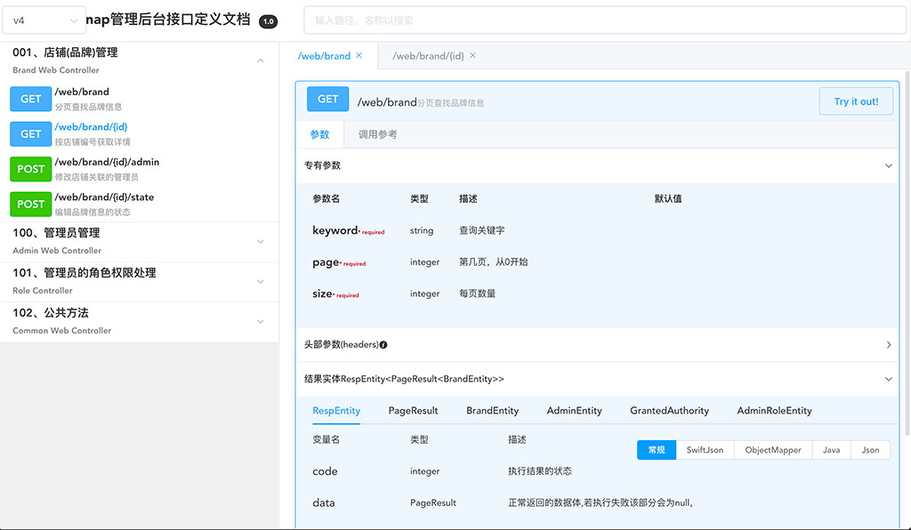
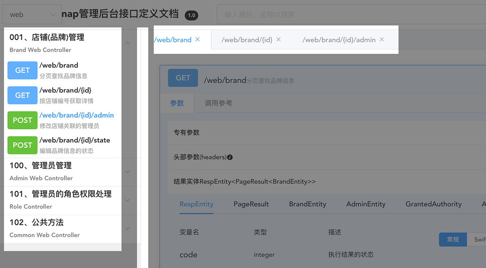
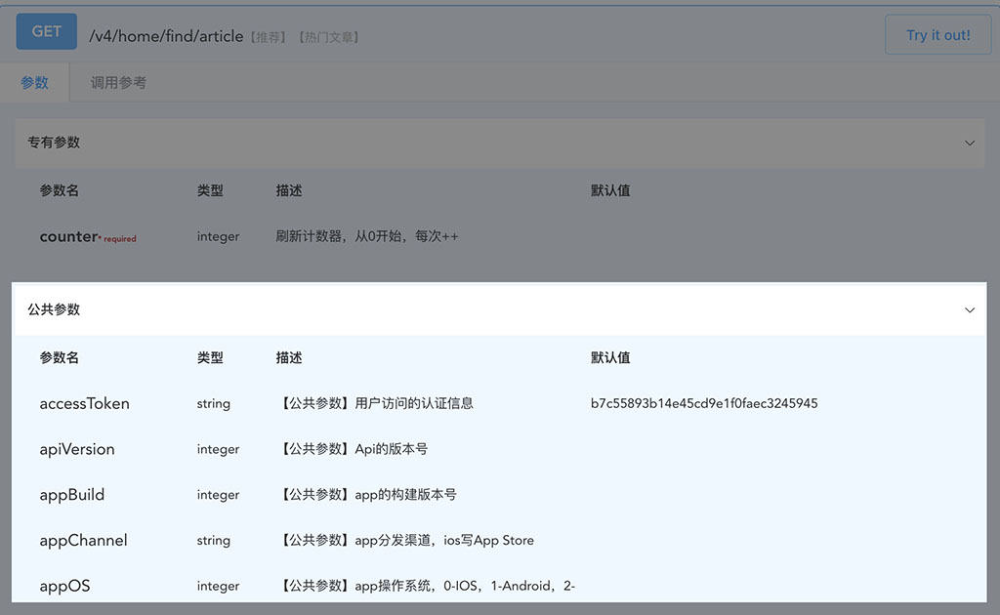
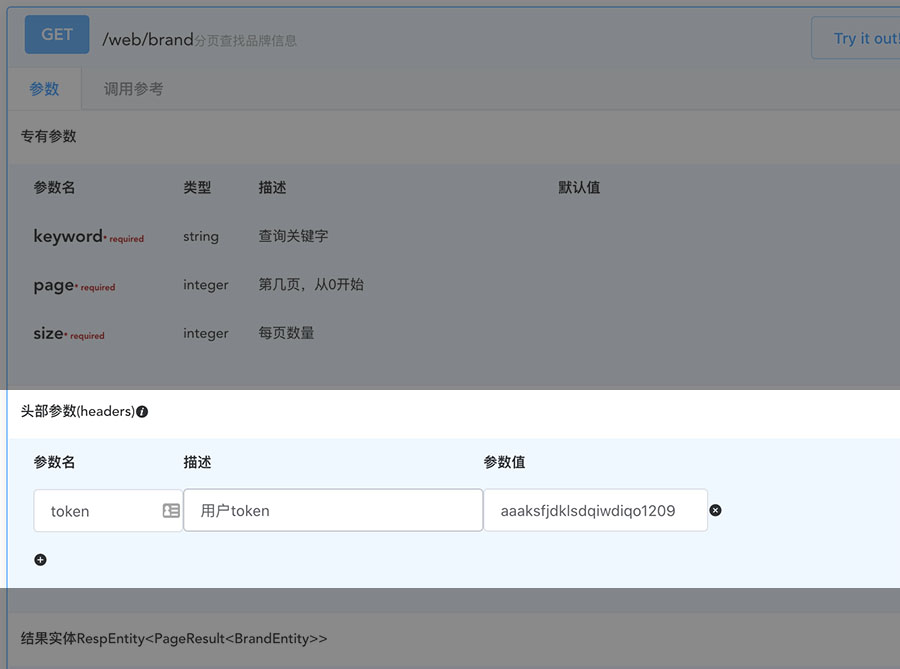
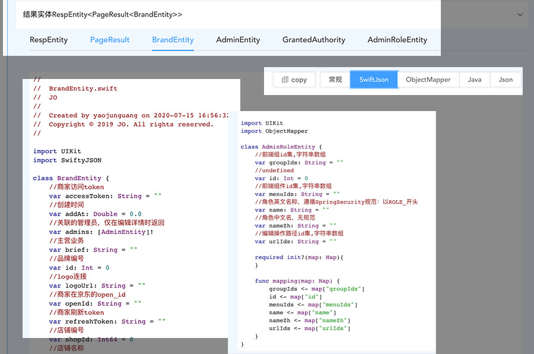
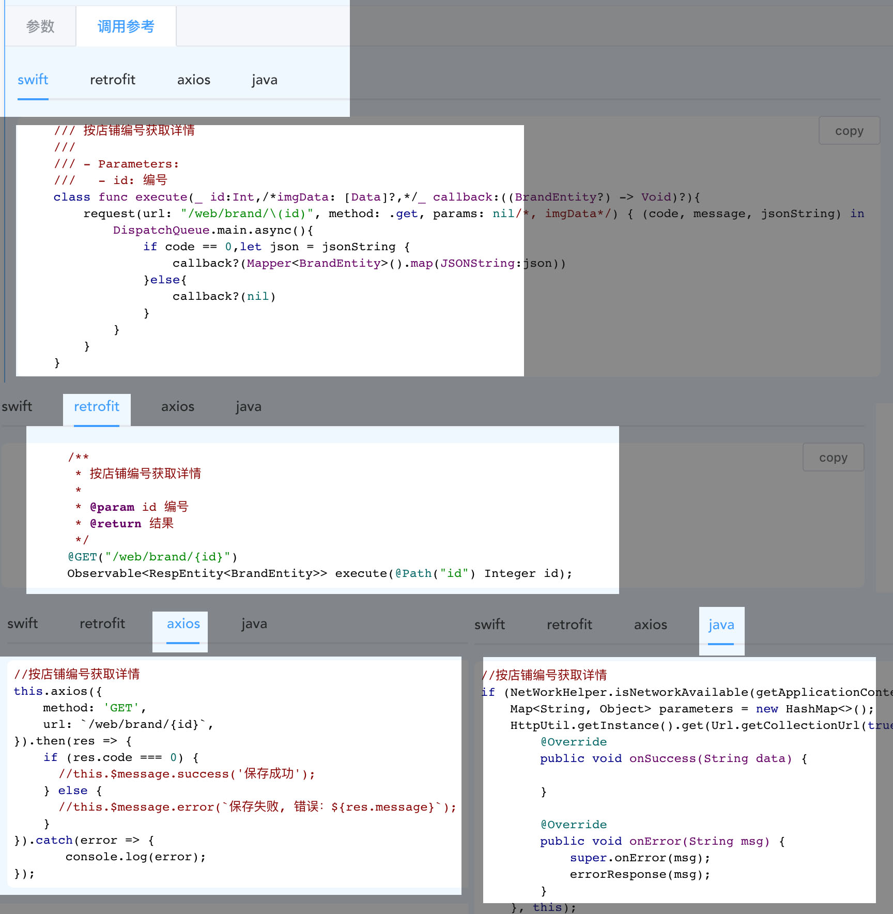
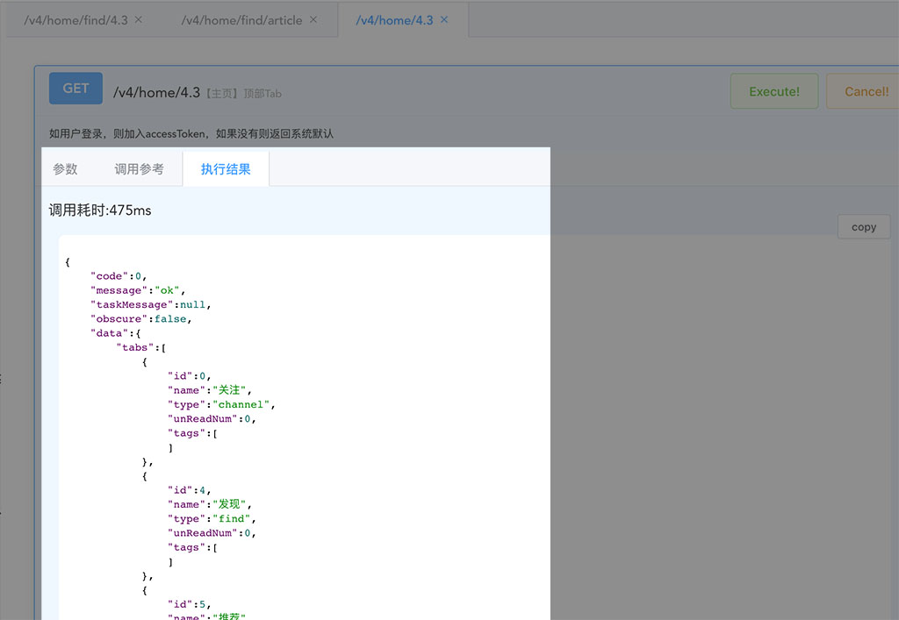

# swagger-ui

> 采用Vue+element-ui构建的swagger-ui  
>支持API分组和排序，支持通过路径或者注释搜索，支持添加自定义请求头  
>支持实体类多语言代码生成(swift,java)  
>支持多种调用过程代码生成(swift retrofit,axios,httpClient)等，多标签模式等 

## 介绍
> 在日常开发中，接口文档维护一直是项目管理中的头疼的问题，还有就是单元测试、接口测试等。swagger是我极具推崇的开发辅助工具，很好的解决了上诉的这些问题  

> 在移动端开发过程中module生成也一直是费力而麻烦的事情(java对android可公共module包解决)，以前也做过一个用java class反射生成 swift module的小工具

> 以前一直在使用springfox-swagger-ui作为swagger的ui展示，但是在实际使用过程中有诸多的不满意的地方，遂结合自己的实际需求，采用Vue+element-ui自行开发了这个项目  
主要的功能特色如下：

##### 0、概览

##### 1、采用左右布局，便于充分利用屏幕空间
##### 2、支持根据api路径或者注释模糊搜索
##### 3、左侧方案按tag分组，便于集中管理
##### 4、左侧导航栏支持宽度调整，调整结果保存到cookie
##### 5、右侧项目部分tab化管理，便于打开多个

##### 6、参数可分组，默认以描述中以"【公共参数】"开头的放入到公共参数中（具体原因后续有机会在介绍），该函数独有参数放入专有参数并默认展开
##### 7、支持添加自定义header，方便在线调试


##### 8、返回实体结果实体类生成
###### 8-1、一键转化为swift和java实体类代码(支持主流ObjectMapper和SwiftJson格式)
###### 8-2、生成代码注释详细、格式化输出、高亮显示，一键复制,保持和后端命名一致性

##### 9、调用示例代码生成
支持swift(ios)、retrofit(android)、axios(Vue)、 httpClient(java) 等主流前端调用代码生成，提高开发效率

##### 10、在线直接调用测试
##### 11、运行结果格式化高亮展示


### 约定

> 该swagger是根据我在日常开发中的一些个人需求自行定制的swagger-ui,其中涉及到诸多约定  
> 1、返回结果为JSON  
> 2、不根据http的状态码判断内部逻辑处理是否正确，而是通过外包一个包装类来返回结果  
> 3、返回结果需要指明类型，这样swagger才能识别，如下面的例子  

```
@ResponseBody
@ApiOperation(value = "喜欢的列表", notes = "喜欢-列表")
@RequestMapping(value = "", method = RequestMethod.GET)
public RespEntity<List<LovesCellEntity>> findByPage(
        @ApiParam(value = "页码")
        @RequestParam(name = "page") int page,
        @ApiParam(value = "类型，0酒单，1文章，2视频")
        @RequestParam(name = "itemType") int itemType,
        BaseReq req) {
    RespEntity<List<LovesCellEntity>> respEntity = RespEntity.One(req);
    try {
        .....
    } catch (Exception ex) {
        error(ex, respEntity);
    }
    return respEntity;
}
```
> 4、为了便于维护管理接口分组，Controller的tag都已数字开头，便于自动排序，如下：
```
@RestController
@Api(tags = {"05、喜欢"})
@RequestMapping(value = "/v8/love")
public class LoveControllerV8 extends BaseControllerV8 {
  .....
}
```

> 5、该项目建立的目的是为了方便交流维护(要有注释)，所涉及的实体对象均需要按照swagger注解要求填写如下返回实体
>> 对于@ApiModel的注解，不要使用value属性，否者会使类名不一直
```
@Data
@ApiModel(description = "CartUiEntity")
public class CartUiEntity {

    @ApiModelProperty("地址编号")
    private int addressId = 0;

    @ApiModelProperty("收件人")
    private String recipient;

    @ApiModelProperty("电话号码")
    private String mobile;

    @ApiModelProperty("详细地址")
    private String addressDetail;

}
```

## 测试运行

> 测试运行中项目中包含了一个swagger文档sample文件，可自行替换（src/assets/api-docs.json）

``` bash
# 依赖安装
npm install

# 测试运行
npm run dev

# 生产打包
npm run build:prod

```

## 打包为JAR

> 打包过程默认为npm run build:prod.会自动切换为包所在的本地环境

``` bash
# mvn生产打包发布
mvn install
```
## 安装

### 前置
> 安装好swagger2，并按默认配置，不需要其他第三方的swagger-ui，只需要加入默认依赖
```
<dependency>
    <groupId>io.springfox</groupId>
    <artifactId>springfox-swagger2</artifactId>
    <version>3.0.0</version>
</dependency>
<dependency>
    <groupId>io.swagger</groupId>
    <artifactId>swagger-annotations</artifactId>
    <version>1.6.2</version>
</dependency>
<dependency>
    <groupId>io.swagger</groupId>
    <artifactId>swagger-models</artifactId>
    <version>1.6.2</version>
</dependency>
```    

### jar复制安装
> 复制生成的swagger-ui-3.1.jar 到你的工程下，添加依赖即可
```
<dependency>
    <groupId>com.smarthito</groupId>
    <artifactId>swagger-ui</artifactId>
    <version>3.1</version>
    <scope>system</scope>
    <systemPath>${pom.basedir}/src/main/libs/swagger-ui-3.1.jar</systemPath>
</dependency>
```    

### maven依赖
```$xslt
<dependency>
    <groupId>com.smarthito</groupId>
    <artifactId>swagger-ui</artifactId>
    <version>3.1</version>
</dependency>
```

## 访问
> 默认页面 /swagger-ui.html
```
http://<host>:<port>/swagger-ui.html
```

## 模拟调用获取接口原始函数方法名
在模拟调用部分的代码，为了便于前端与后端开发保持沟通一致性，我特意留出了一个接口（可不实现，调用示例采用execute），通过后端获取当前的接口在后端的方法名，后端示例代码如下:
获取方法名的接口路径固定的，不可修改：/swagger/method
```
@RestController
@RequestMapping(value = "/")
public class RootController {

    @Autowired
    private RequestMappingHandlerMapping requestMappingHandlerMapping;

    @ApiOperation(value = "获取java方法名")
    @RequestMapping(value = "/swagger/method")
    public HashMap<String, String> findMethodName(
            @ApiParam(value = "路径", required = true)
            @RequestParam String url,
            @ApiParam(value = "调用类型", required = true)
            @RequestParam String type) {
        HashMap<String, String> hashMap = new HashMap<>(2);
        if ("/".equals(url) && "func".equals(type)) {
            hashMap.put("result", "true");
            return hashMap;
        }
        Map<RequestMappingInfo, HandlerMethod> map = requestMappingHandlerMapping.getHandlerMethods();
        for (Map.Entry<RequestMappingInfo, HandlerMethod> m : map.entrySet()) {
            RequestMappingInfo info = m.getKey();
            HandlerMethod method = m.getValue();
            PatternsRequestCondition p = info.getPatternsCondition();
            String mUrl = null;
            for (String url2 : p.getPatterns()) {
                mUrl = url2;
            }
            RequestMethodsRequestCondition methodsCondition = info.getMethodsCondition();
            String mType = methodsCondition.toString();
            if (mType != null && mType.startsWith("[") && mType.endsWith("]")) {
                mType = mType.substring(1, mType.length() - 1);
            }
            if (mUrl != null && mType != null && mUrl.equals(url) && mType.equals(type.toUpperCase())) {
                hashMap.put("method", method.getMethod().getName());
                hashMap.put("className", method.getMethod().getDeclaringClass().getName());
                return hashMap;
            }
        }
        return null;
    }
}
```

## TODO:
> 1.支持OC和Kotlin  
目前自己的项目中还未采用OC Kotlin，加上这两个的语法不是很熟悉，所以目前还不支持先关的代码生成


> 2.支持枚举对象的导出  
实际开发中，状态变量的枚举一直是前后端沟通的问题，这个部分的导出需要一些开发约定，在未想好对开发过程无干扰的情况下暂时搁置（java 采用class反射可实现，但对开源项目安全性角度不想采用）。

## 后语：
> 该项目对于采用swagger注释完善度要求极高，这样可以使整个工具呈现完美状态，这个部分也有一些其它的自定义小工具，后续会再分享，如：数据库表生成module的groovy schema等

```
 export GPG_TTY=$(tty)
```
